# 项目总结
## 目录
[TOC]

## 项目描述

- 项目名称：好客租房

- 项目来源：哔哩哔哩-黑马前端开源项目（BV14y4y1g7M4）

- 项目地址：https://gitee.com/CHAS-JIN/hkzf

- 开发环境：Node.js-v16.17.1, MySQL-v8.0.30

- 技术栈：

  | 技术栈           | 版本   |
  | :--------------- | :----- |
  | react            | 18.2.0 |
  | react-redux      | 8.0.2  |
  | @reduxjs/toolkit | 1.8.5  |
  | react-router     | 6.3.0  |
  | react-bmapgl     | 0.2.7  |
  | antd-mobile      | 5.24.0 |
  | axios            | 0.27.2 |

- 主要页面：主页、房源列表、我的信息、城市列表、地图找房、搜索房源、登录、我的收藏、我的出租、出租房屋、房屋详情

- 实现功能：登录、注册、登出、查看我的收藏、收藏、取消收藏、查看我的出租、出租房屋；定位当前城市、显示当前城市房源、地图（百度地图接口）找房、筛选器筛选房源数据（位置、价格、出租形式、户型、朝向、配置、面积、楼层）、搜索找房


------


## 遇到的问题 & 解决方案

### Redux 相关

#### 三原则：

1. 单一数据源（store是唯一的）
2. State是只读的（一旦修改就会产生新的状态）
3. 使用纯函数来执行修改（同样的输入必定得到同样的输出。不能改变参数）

#### Slice 初始值设置及值的更新问题

以对象形式存储数据，更新时以修改对象属性值的形式更新数据 `state.value = action.payload `

#### 报错

reducer 必须为纯函数

#### RTKQ

不知道如何在组件挂载时发送请求（钩子函数规则：在组件最外层使用，避免嵌套），弃用，改回使用 axios

### React-Router v6 相关

#### 二级路由组件显示问题

使用 <Outlet /> ，在哪显示就放在哪里（在对应一级路由组件中）

#### 二级路由组件发送网络请求不受控

改为一级路由

#### 路由传参

1. 路径中设置 `params` 参数：
   路由表中应设置 `path:':param'` ，使用 `const {param} = useParams()` 接收
2. 编程式导航：
   `navigate(path,{state:{ isRent: true }})` 发送参数，`const {state} = useLocation()` 接收

### React 相关

#### useEffect 控制在组件挂载时发送网络请求问题

```react
useEffect(()=>{
	// effect
	return ()=>{
		// cleanup
	}
},[input])
```

定义一个异步请求函数，在回调函数中调用，第二个参数为空数组

第二个参数为依赖项，空数组表示挂载时调用回调，添加依赖项表示依赖项发生变化时调用回调，`return` 中表示组件卸载时执行的内容，常用作定时器的卸载

#### useState 数据更新问题

##### React 18 版本之前

[今天让你彻底搞懂setState是同步还是异步](https://zhuanlan.zhihu.com/p/350332132)

```react
const [data,setData] = useState()

const add = ()=>{
    // 异步
    setData(data + 2)
    // 同步
    setData(pre => pre + 2)
    // 同步
    Promise.resolve().then(()=>{
        setData(data + 2)
    })
}
```

1. 在正常的 react 的事件流里（如`onClick`等）

   `setState` 和 `useState` 是异步执行的（不会立即更新 state 的结果）
   多次执行`setState`和`useState`，只会调用一次重新渲染 render
   不同的是，`setState`会进行 state 的合并，而`useState`则不会

2. 在` setTimeout`，`Promise.then`等异步事件中

   `setState`和`useState`是同步执行的（立即更新state的结果）
   多次执行`setState`和`useState`，每一次的执行`setState`和`useState`，都会调用一次render

##### React 18 版本之后

[React18 setState: 消失的面试题](https://zhuanlan.zhihu.com/p/460668459)

所有的 `setState` 都是非同步的，只有在使用 `ReactDOM.render` 的时候(Legacy Mode)才会保持之前的行为，否则都会对你的更新进行合并处理，也就是自动批处理。

可以使用 `flushSync` 函数实现同步：

```react
import React,{ useState } from 'react'
import { flushSync } from 'react-dom'

function APP() {
  const [data, setData] = useState()

  const test = () => {
    setTimeout(() => {
      flushSync(() => {
        setData(2);
      })
      console.log('data', data);
        
      flushSync(() => {
        setData(3);
      })
      console.log('data', data);
    }, 0)
  }

  return (
  	<div>
      <button onClick={test}>
        {data}			
      </button>
    </div>
  )
}

export default App;
```

> **注意**
>
> 与 class 组件中的 `setState` 方法不同，`useState` 不会自动合并更新对象。你可以用函数式的 `setState` 结合展开运算符来达到合并更新对象的效果。
>
> ```react
> const [state, setState] = useState({});
> setState(prevState => {
>   // 也可以使用 Object.assign
>   return {...prevState, ...updatedValues};
> });
> ```
>
> `useReducer` 是另一种可选方案，它更适合用于管理包含多个子值的 state 对象。

### Axios 相关

#### axios.post 添加 headers

axios.post(url,data?{}:undefined,config?{}:undefined)


------


## 学习笔记

### antd-mobile API 相关 (v5.24.0)

#### TabBar

```react
const location = useLocation()
const { pathname } = location
const navigate = useNavigate()
const setRouteActive = value => {
	navigate(value, { replace: true })
}
const tabs = [{key,icon:ReactNode,title}]
<TabBar
  activeKey={pathname}
  onChange={value => setRouteActive(value)}
>
  {tabs.map(item => (
	<TabBar.Item key={item.key} icon={item.icon} title={item.title} />
  ))}
</TabBar>
```


#### Swiper

```react
<Swiper autoplay loop>
    // 别忘了设置 key 值
    <Swiper.Item key={key}>
        content
	</Swiper.Item>
</Swiper>
```

#### Grid

```react
<Grid columns={2} gap={12}>
	// 别忘了设置 key 值
    <Grid.Item key={key}>
        content
	</Grid.Item>
</Grid>
```

#### DropDown

```react
<Dropdown 
    closeOnClickAway={true}
>
	// 别忘了设置 key 值
    <Dropdown.Item key={key} title='title'>
        content
	</Dropdown.Item>
</Dropdown>
```

#### Selector

```react
<Selector
	columns={3}
	options={room}
	multiple={true}
	onChange={arr => setSelectedRoom(arr)}
/>
```

#### Popup

```react
<Popup
    visible={visible}
    onMaskClick={toggle}
    position="right"
    bodyStyle={{ minWidth: '80vw' }}
    className={styles.cont}
>
```

#### IndexBar

```react
let groups
groups = Array(data.length)
	.fill('')
	.map((_, i) => ({
		index,
		title,
		items,
	}))

<IndexBar>
  groups.map(group => {
    const { title, items, index } = group
      return (
        <IndexBar.Panel 
          index={index} 
          title={title} 
          key={title}
        >
          <List>
            {items.map(item => (
              <List.Item
                key={item.value}
                onClick={() => changeCity(item)}
				arrow={false}
			  >
				{item.label}
			  </List.Item>
			))}
		  </List>
        </IndexBar.Panel>
	  )
  })}
</IndexBar>
```

#### Modal

```react
Modal.show({
  content: '该操作需要登录，前往登录吗？',
  actions: [
    {
      key: 'cancel',
      text: '取消',
      onClick: () => Modal.clear(),
    },
    {
      key: 'confirm',
      text: '确定',
      onClick: () => {
        Modal.clear()
        navigate('/login')
      },
      primary: true,
    },
  ],
})

Modal.clear()
```

#### Toast

```react
Toast.show({
	icon: 'loading',
	content: '加载中......',
})

Toast.clear()
```

#### Tag

```react
tags.map((tag, index) => {
	const tagClass = `tag${(index % 3) + 1}`
    <Tag
		fill="solid"
		className={styles[tagClass]}
		key={index}
		style={{ marginRight: '10rem' }}
	>
		{tag}
	</Tag>
}
```

#### Picker

```react
// 数据为 二级数组
const roomTypeData = [
	[
		{ label: '一室', value: 'ROOM|d4a692e4-a177-37fd' },
	],
]

<Picker
	columns={roomTypeData}
	visible={roomVisible}
	onClose={() => {
		setRoomVisible(false)
	}}
>
    // 渲染所选值
	{items => {
		if (items.every(item => item === null)) {
			return <span style={{ color: '#ccc' }}>未选择</span>
		} else {
			return items.map(item => item?.label)
		}
	}}
</Picker>
```

#### ImageUploader

```react
// 保存上传的图片
const saveImg = file => {
	setFileList(pre => [...pre, file])
	return {
		file: file,
        // 必须，否则显示出错
		url: URL.createObjectURL(file),
	}
}

<ImageUploader multiple={true} upload={saveImg} />
```

#### TextArea

```react
<TextArea
	placeholder="请输入信息"
	autoSize={{ minRows: 2, maxRows: 10 }}
/>
```

#### Form

```react
// 需要声明一个Form表单实体
const [form] = Form.useForm()
// 获取所有表单数据
const data = form.getFieldsValue(true)

<Form form={form} mode='card' footer={footer}>
    <Form.Item
		// 表单项的标识，用于获取、设置值等操作
		name='password' 
		rules={[
             {
                 required: true,
                 message: '不能为空!',
                 type: 'string',
                 whitespace: true
             },
        ]}
	>
    	<Input placeholder="请输入密码" type="password"/>
    </Form.Item>

	<Form.Item
		name='passwordConfirm'
		// 依赖项，当依赖项改变时重新触发验证
		dependencies={['password']}
		rules={[
             {
                 required: true,
                 message: '不能为空!',
                 type: 'string',
                 whitespace: true,
                 // 验证器，需要返回 Promise
                 validator: (_, value) => {
					if (value === form.getFieldValue('password')) {
						return Promise.resolve()
					}
					return Promise.reject()
				 },
             },
        ]}
	>
    	<Input placeholder="请输入密码" type="password"/>
    </Form.Item>

	<From.Item
		// Picker 的触发条件是 点击确认按钮，即：onConfirm
		trigger="onConfirm"
	>
            <Picker>
            	{}
			</Picker>
	</Form.Item>
</Form>
```


### 百度地图 API 相关

#### JS API

引入百度地图 API

```react
<!-- 百度地图API -->
<script type="text/javascript" src="https://api.map.baidu.com/getscript?type=webgl&v=1.0&ak=密钥"/>
```

创建地图

```react
const map = new BMapGL.Map('container')
let myMap = map
// 地图容器
<div id="container"></div>
```

创建地址解析器

```react
// 创建地址解析器实例
const myGeo = new BMapGL.Geocoder()
```

显示解析结果

```react
// 将地址解析结果显示在地图上，并调整地图视野
myGeo.getPoint(
	'label',
	point => {
		// 设置中心和缩放
		map.centerAndZoom(point, 11)
		// 鼠标滚轮缩放
		map.enableScrollWheelZoom(true)
		// 渲染覆盖物
		renderOverlays(value)
	},
	'label'
)
```

监听地图事件

```react
// 监听地图拖动事件，拖动时隐藏房屋列表
map.addEventListener('dragstart', () => {
	setIsShow(false)
})
```

创建覆盖物 （以 label 为例）

```react
const label = new BMapGL.Label('', {
	position: point,
	offset: new BMapGL.Size(-35, -35),
})
```

设置覆盖物内容

```react
label.setContent(`
<div class="${styles.bubble}">
    <p>${areaName}</p>
    <p>${count}套</p>
</div>`)
```

设置覆盖物样式

```react
// 样式
const labelStyle = {
    border: '0px solid rgb(255, 0, 0)',
    padding: '0px',
    whiteSpace: 'nowrap',
    fontSize: '26rem',
    color: 'rgb(255, 255, 255)',
    backgroundColor: 'none',
}

label.setStyle(labelStyle)
```

监听覆盖物事件

```react
// 设置房源覆盖物监听事件
label.addEventListener('click', function () {
	myMap.clearOverlays()
	myMap.centerAndZoom(point, zoom)
	renderOverlays(value)
})
```

添加覆盖物到地图

```react
myMap.addOverlay(label)
```

### React-BMapGL API

导入依赖包

```react
import Map from 'react-bmapgl/dist/Map/Map'
import Label from 'react-bmapgl/dist/Overlay/Label'
```

创建地图和覆盖物

```react
<Map
	center={{ lng, lat }}
	zoom="17"
	style={{ height: '320rem' }}
>
	<Label
		position={
			new BMapGL.Point(longitude, latitude)
		}
		offset={new BMapGL.Size(0, -36)}
		text={houseData.community}
		style={labelStyle}
	/>
</Map>
```


------


## 功能实现

### App.js

通过百度地图API，获取当前城市名称，通过 /area/info 请求当前城市相关信息

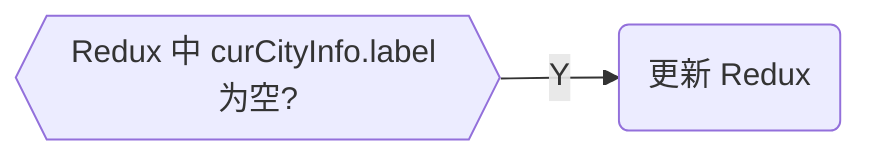

### 组件 (component)

#### AuthCheck

权限控制路由组件，包在需要登录权限的页面外面，当通过路由访问时检查登录状态并返回值

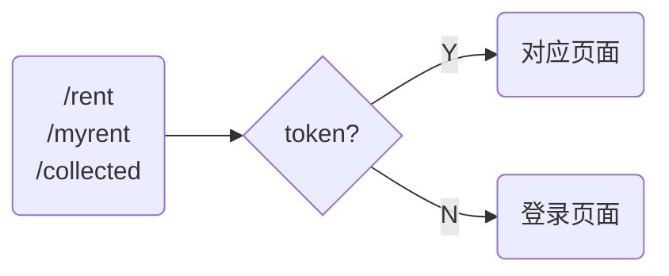

#### Swipers

轮播图组件，用于主页和房屋详情页

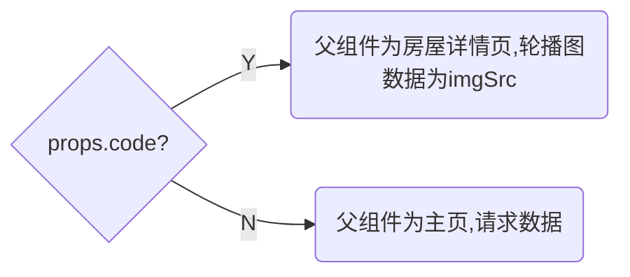

#### MyNavBar

自己封装的 antd-mobile `<NavBar/>` 组件

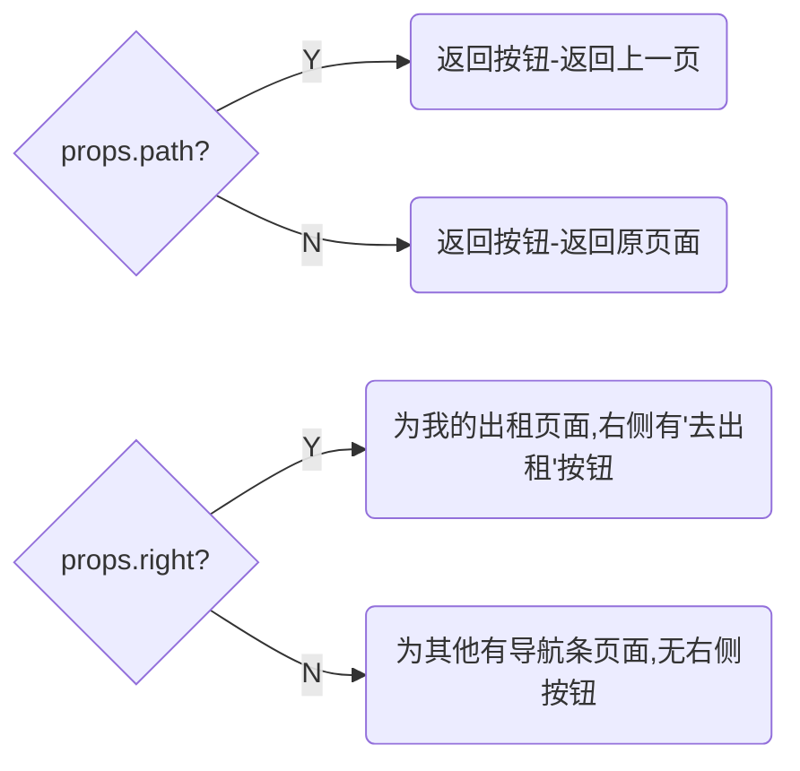

#### HouseItem

房屋列表项组件，接收父组件传来的数据并显示，点击将房屋标识通过路由发送到 HouseDetail 页面

#### HousePackage

房屋配置组件，用于房屋详情页和出租页

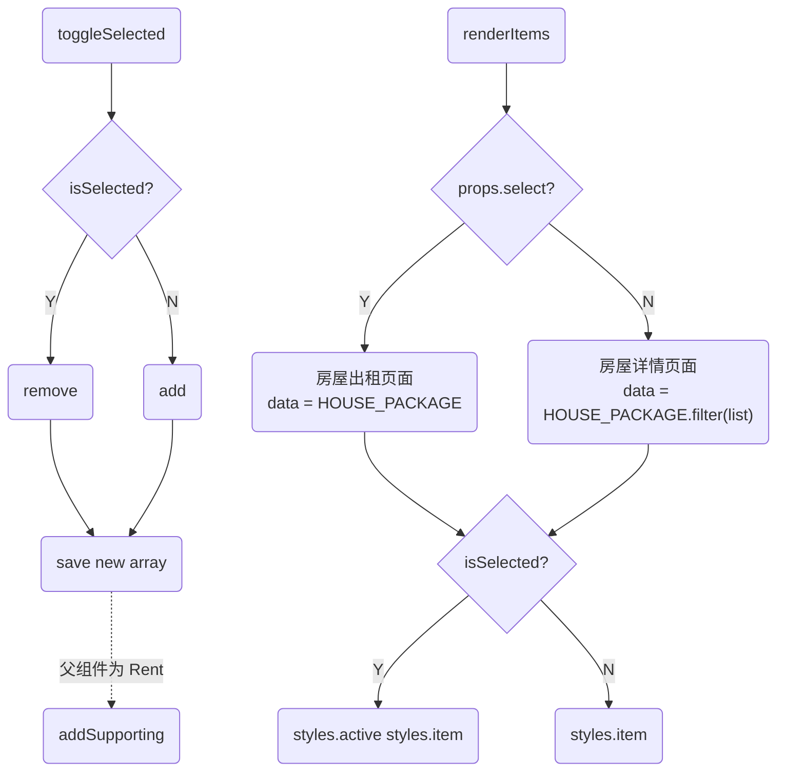

#### Filter 

筛选器，用于房屋列表页面筛选数据

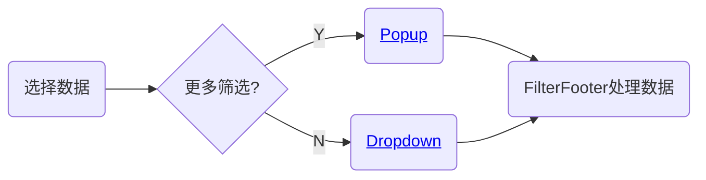

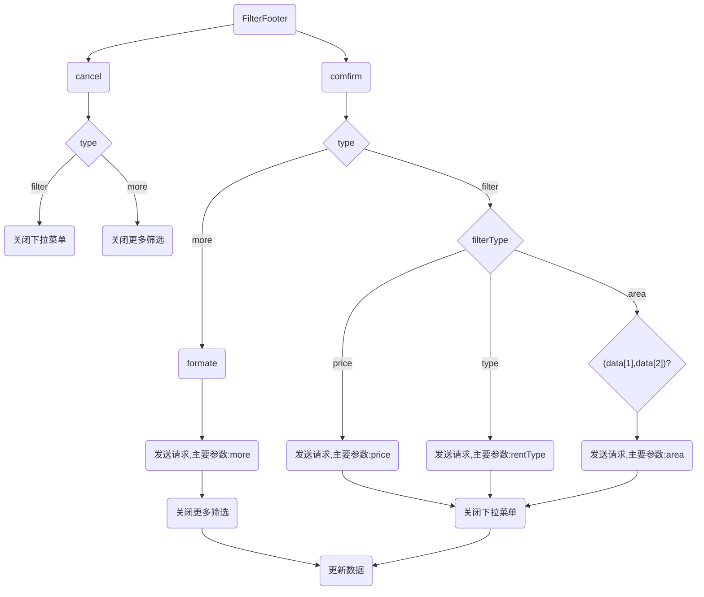

### Pages

#### CityList

城市名称列表，用于选择要定位的城市

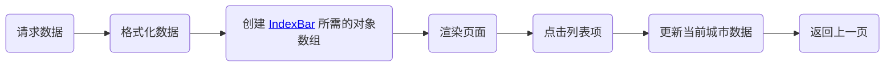

#### HouseDetail

房屋详情页，展示轮播图、详情、地图、配套、概况、推荐，实现收藏、取消收藏

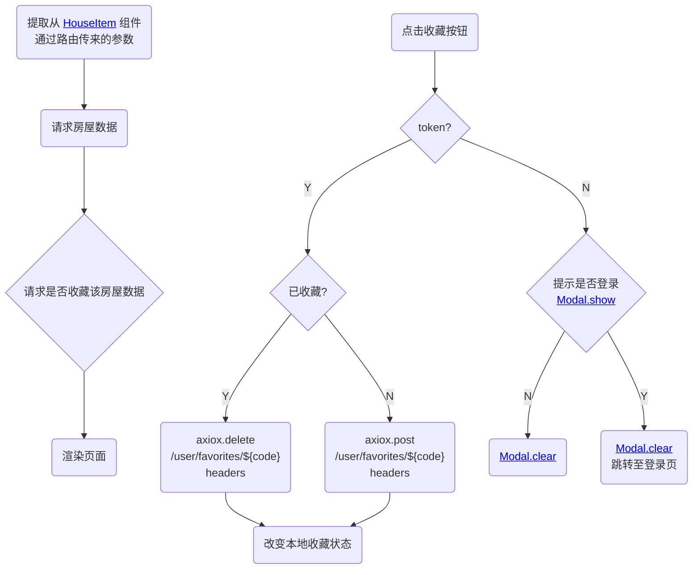

#### HouseList

房源列表页，展示当前城市房源，通过筛选器筛选房源

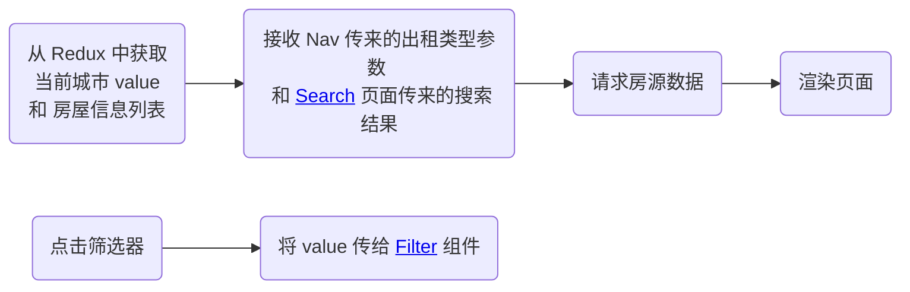

#### Login

登录页，实现登录和注册

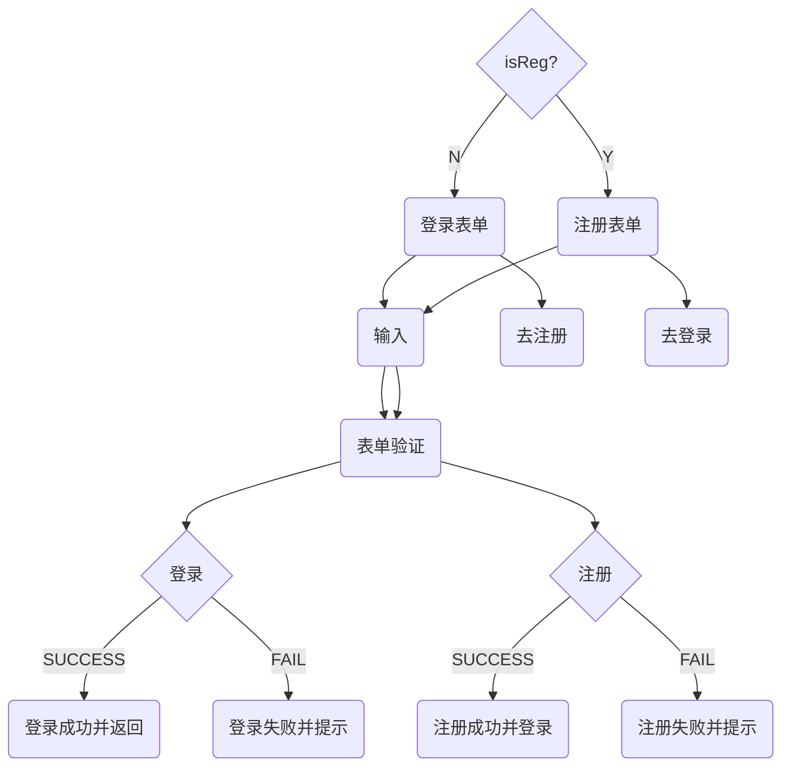

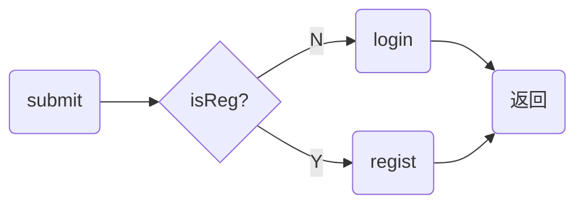

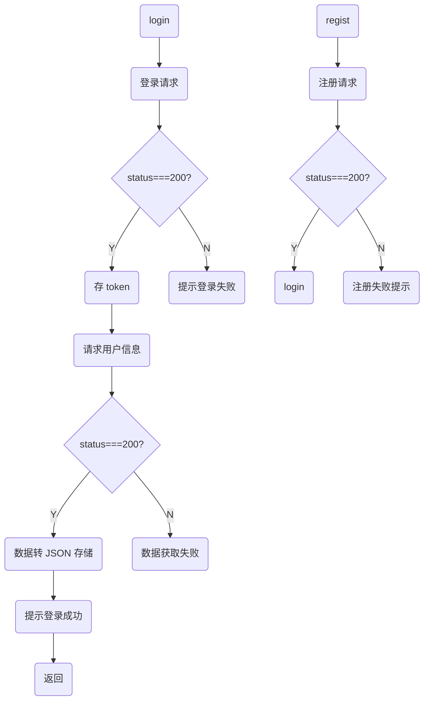

#### Profile

我的信息页，主要实现登出功能

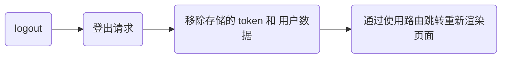

#### Search

<p id='search'> </p>

搜索页，输入小区名搜索小区，用于 [HouseList](#houselist) 和 [Rent](#rent) 页面

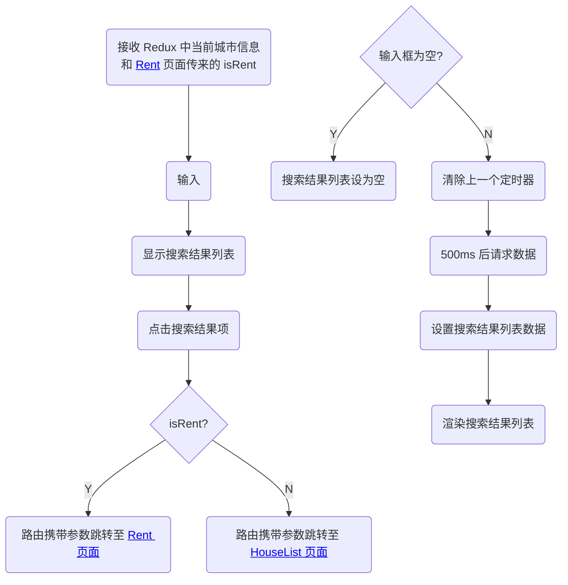

#### Rent

出租页面，输入房屋出租的各项信息

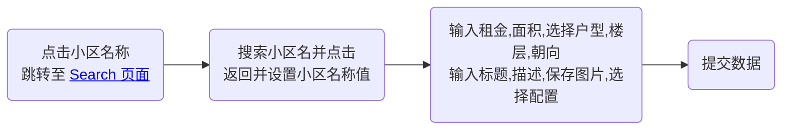

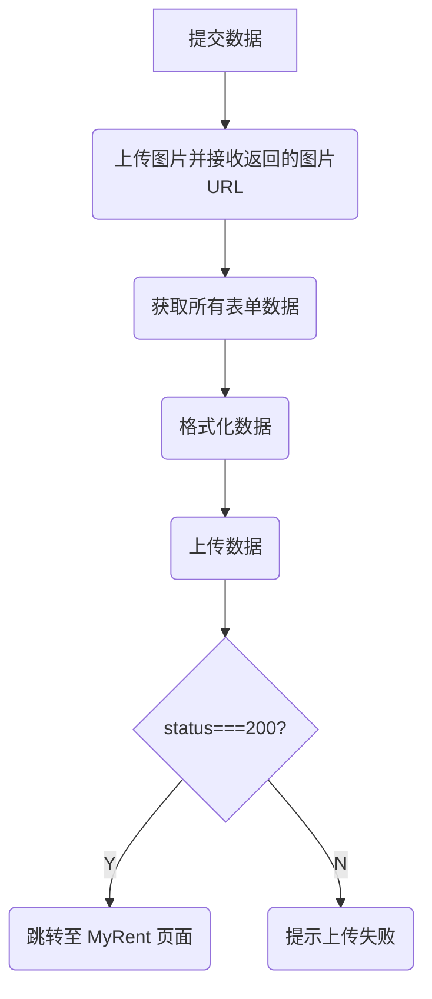

#### Map

地图找房页面，通过地图查找当前城市房源

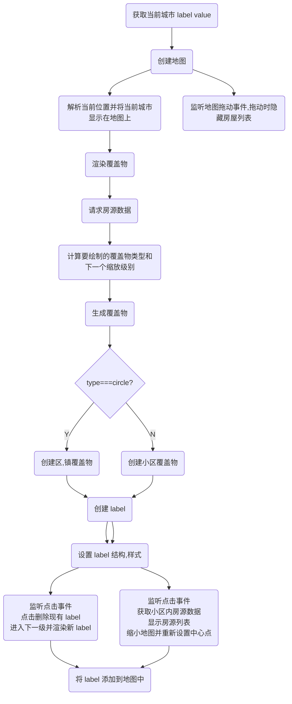

------

## 小结

进一步加深对React、Redux、React-Router、ES6 等技术的理解和应用，学会了使用百度地图API实现地图找房功能、定位城市功能，学会了 React v18、React-Router v6的新特性及其使用。


